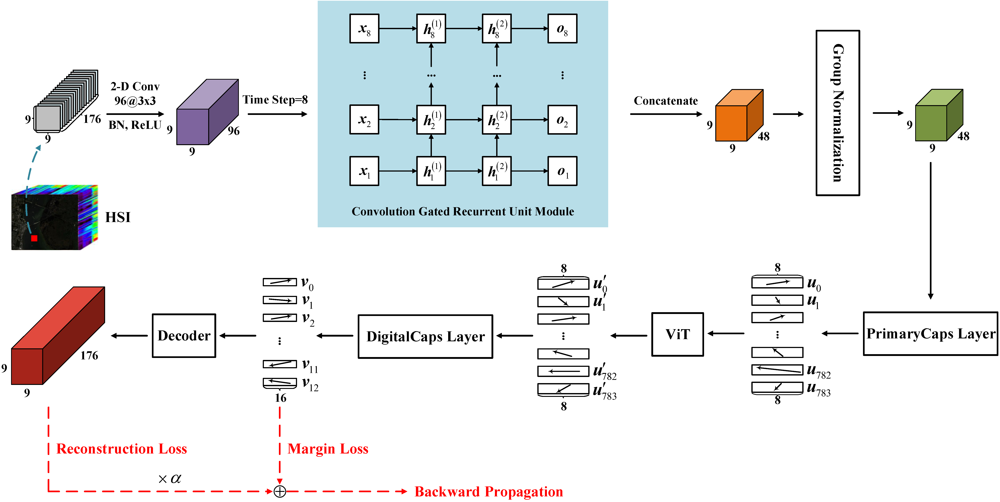
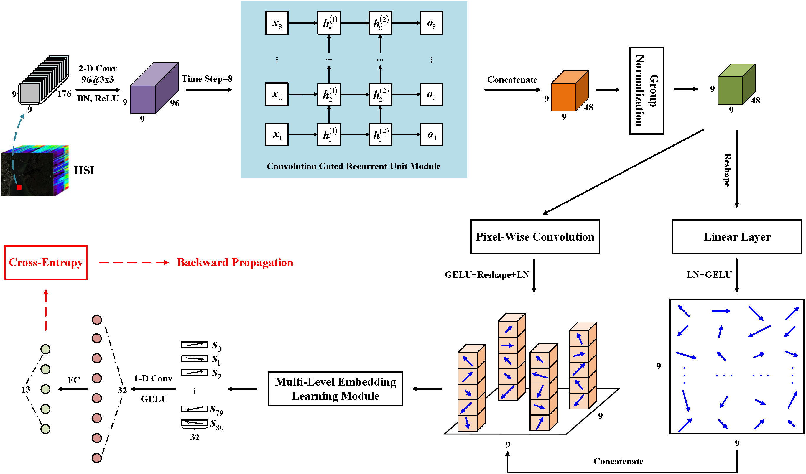
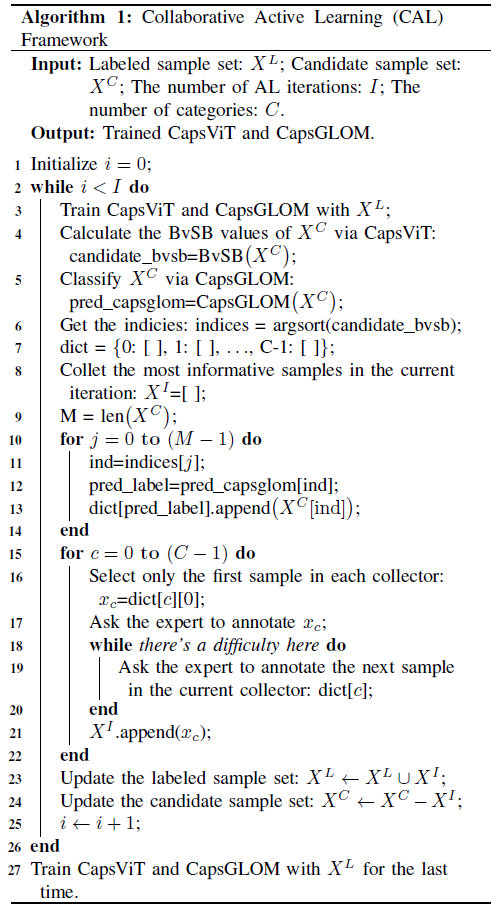
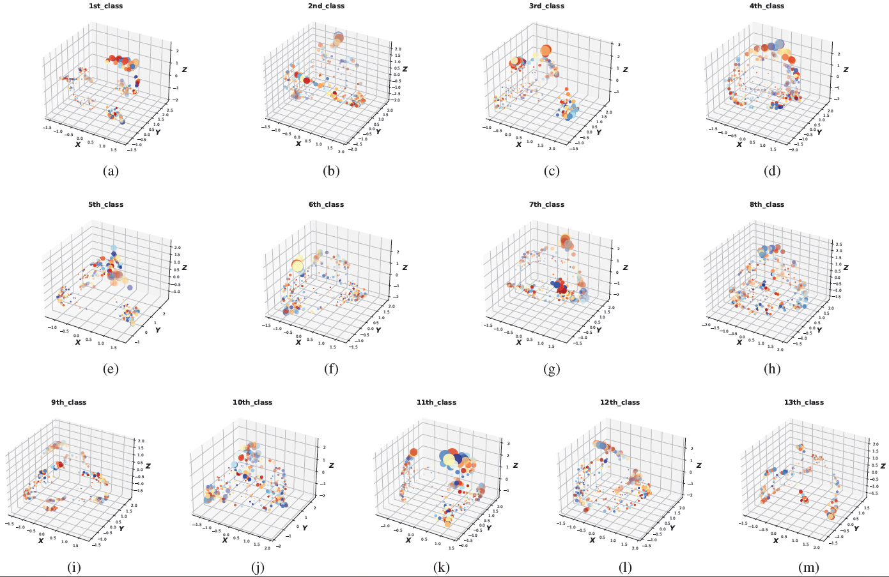
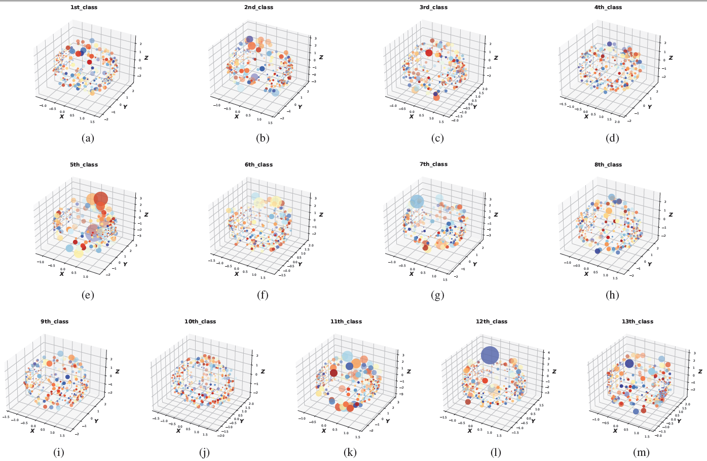

# CAL
Collaborative Active Learning based on Improved Capsule Networks for Hyperspectral Image Classification

Code download link: [CAL](https://github.com/swiftest/CAL/archive/refs/heads/main.zip).

Here is the bibliography info:
<br/>

```jason
@article{Wang2023CAL,  
  title={Collaborative Active Learning based on Improved Capsule Networks for Hyperspectral Image Classification},  
  author={Wang, Heng and Wang, Liguo},  
  journal={IEEE Transactions on Geoscience and Remote Sensing},  
  year={2023},  
  DOI (identifier)={10.1109/TGRS.2023.3309269},  
  publisher={IEEE}  
}
```

## Steps:
- Place the target data set into the 'dataset' folder.
- Make sure the GPU accelerator is available.
- Run Caps-GLOM.ipynb in the Jupyter environment (ensure that external modules such as einops and torchsummary are installed).


## Descriptions
In this paper, we propose a CAL framework based on improved capsule networks for HIC. The proposed CAL framework includes two excellent base classifiers and a CAL scheme that considers both the diversity of actively selected samples and the cost of expert annotation. The first base classifier is CapsNet combined with ViT, which is named CapsViT. By introducing ViT, CapsViT can better learn the global correlation between various primary capsules and improve classification performance.



Fig1. The proposed CapsViT for HIC.

The second base classifier is designed based on the improved GLOM system and named CapsGLOM. Instead of using the pre-assigned universal capsule to learn the multi-level embeddings at various positions, CapsGLOM borrows from the way CapsNet builds primary capsules and lets the network learn these embeddings itself.



Fig2. The proposed CapsGLOM for HIC.

AL experiments on four benchmark HSI data sets show that our proposed CapsViT and CapsGLOM can obtain good or even the best classification performance on the initial training set, which puts the way for the subsequent active selection of the most informative samples. At the same time, the proposed CAL framework is flexible, and any excellent deep model can be used to replace either of the two base classifiers we designed, as long as it can handle samples with the same form (dimension). In addition, compared with advanced deep models, out proposed CapsViT and CapsGLOM can obtain very competitive results in supervised classification experiments on four data sets. In addition, compared with advanced deep models, out proposed CapsViT and CapsGLOM can obtain very competitive results in supervised classification experiments on four data sets.

The proposed CAL scheme not only considers the uncertainty and diversity of actively selected samples, but also takes into account the cost of expert labeling.


 
The output of PrimaryCaps layer and ViT module for the 13 7 × 7 training samples (KSC data set) are shown in Fig.9 and Fig.10, respectively. By comparing Fig.9 and Fig.10, we can find that the output of the PrimaryCaps layer is relatively discrete, which only focus on the location and probability of the occurrence of various features, while the output of the ViT module is more uniform, and some features will become more obvious after considering the global correlation between all features.



Fig9. Visualization of the PrimaryCaps layer output in CapsViT for the KSC data set. Each dot represents a capsule feature, and the size of the dot indicates the probability of occurrence of the entity feature. (a)-(m) Features of 13 7 × 7 training samples.



Fig10. Visualization of the ViT module output in CapsViT for the KSC data set. Each dot represents a capsule feature, and the size of the dot indicates the probability of occurrence of the entity feature. (a)-(m) Features of 13 7 × 7 training samples.

## Result

### Kennedy Space Center (KSC) Data Set

The KSC data set classification results [CapsViT: OA: 98.96±0.42(%); AA: 98.18±0.70(%); Kappa: 0.9844±0.005; CapsGLOM: OA: 98.74±0.38(%); AA: 97.85±0.63(%); Kappa: 0.9859±0.004] of CapsViT and CapsGLOM using random 10% samples for training.

### Houston University 2013 (HU2013) Data Set

The HU2013 data set classification results [CapsViT: OA: 98.05±0.21(%); AA: 97.81±0.34(%); Kappa: 0.9789±0.002; CapsGLOM: OA: 98.16±0.35(%); AA: 98.15±0.49(%); Kappa: 0.9801±0.004] of CapsViT and CapsGLOM using random 10% samples for training.

### Pavia University (PU) Data Set

The PU data set classification results [CapsViT: OA: 98.79±0.22(%); AA: 97.75±0.39(%); Kappa: 0.9839±0.003; CapsGLOM: OA: 98.79±0.24(%); AA: 97.73±0.58(%); Kappa: 0.9839±0.003] of CapsViT and CapsGLOM using random 2% samples for training.

### Chikusei Data Set

The Chikusei data set classification results [CapsViT: OA: 98.76±0.31(%); AA: 98.69±0.52(%); Kappa: 0.9856±0.004; CapsGLOM: OA: 98.77±0.25(%); AA: 98.72±0.21(%); Kappa: 0.9858±0.003] of CapsViT and CapsGLOM using random 30 samples per-class for training.

## Acknowledgement

The authors would like to thank the Editor, Associate Editor, and anonymous reviewers for their helpful comments and suggestions that improved this article.
